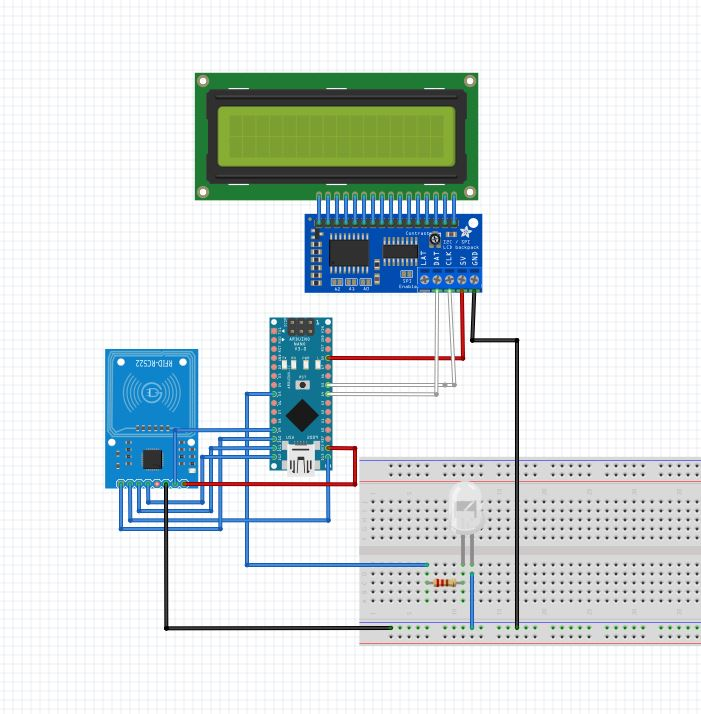
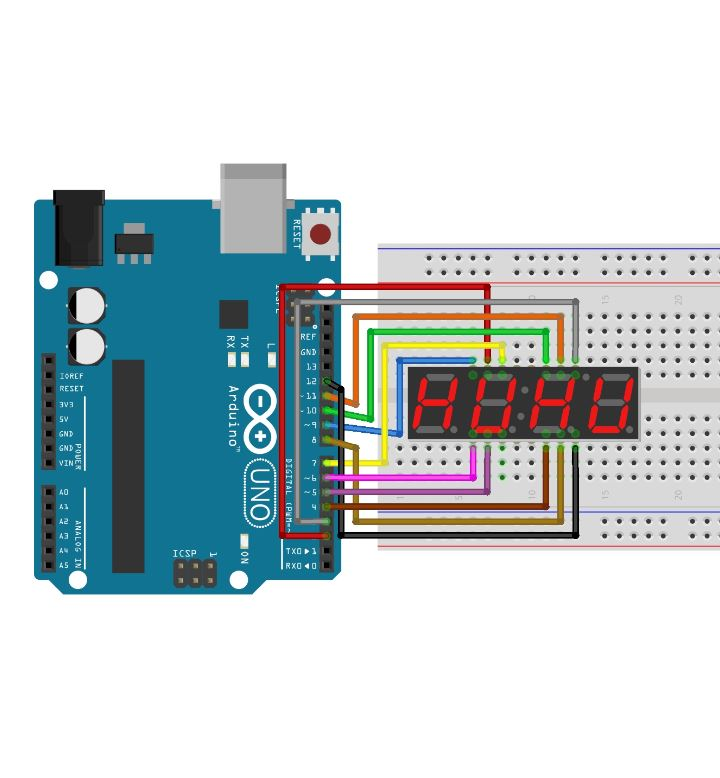

# Submarine Installation

To upload code to the Microcontroller, download Arduino and choose the appropriate microcontroller version.

## Files

- `write_nfc` contains all files that are neccassary to upload the code to the
- `main` contains all the files that comunicate with Unity through Serial Communication, read NFC key and display values on LED display.
- `main2` contains all the files that comunicate with Unity through Serial Communication and display values on the 4 digit LED display

## Components

- 2 Arduino Nanos or any other 2 small microcontrollers (+ 2 USB cabels)
- LCD display
- Buttons
- LED lights
- RC522 RFID/NFC reader
- 4 digit 7 segment LED display

## MAIN 1

Description: This code listens for a value named "PLA" when the value is recieved the light lights up and the user is able to scan a tag with the NFC reader. The recognized item is displayed on the LCD display and an appropriate number is sent through the serial port.

The code to upload the code to the NFC tag is in `write_nfc`.

## MAIN 2

Description: This code listens through the serial port for a number between -999 and 999 and displays it on the display. This number shows the depth of the submarine.

Connect the wires as you wish to digital input pins and modify the code so that the following requirements are met:

- pin 1 - E
- pin 2 - D
- pin 3 - DP/dot
- pin 4 - C
- pin 5 - G
- pin 6 - D4
- pin 7 - B
- pin 8 - D3
- pin 9 - D2
- pin 10 - F
- pin 11 - A
- pin 12 - D1

